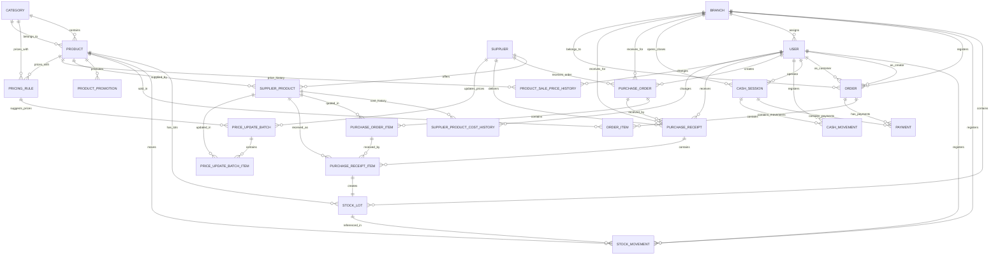

# Domain Model

## Core principle

This is **not** two separate systems. The backoffice (ERP) and the online store (e-commerce) share a single commercial core. Orders, payments, products, stock, suppliers, prices, and customers are unified entities.

## Conceptual structure

```text
Dietetica Lembas
├── Global catalog
│   ├── Products and categories
│   ├── Current sale price on products
│   ├── Sale price history
│   └── Pricing rules for suggested sale prices
├── Suppliers and purchasing
│   ├── Supplier-product current replacement costs
│   ├── Replacement cost history
│   ├── Purchase orders, which do not affect stock
│   ├── Purchase receipts, which create stock
│   └── Reviewed price update batches
├── Branches
│   ├── Stock by lots with expiration dates and frozen unit costs
│   ├── Stock movements for traceability
│   ├── In-store sales, orders with type=POS
│   └── Online order preparation, orders with type=ONLINE
└── Unified payments
    ├── Online payments through Mercado Pago Checkout Pro
    └── In-store payments associated with cash register
```

## Entity relationship diagram



## Domain decisions

| Decision | Rationale |
|---|---|
| Available stock = SUM(stock_lots.quantity_available) | Stock lots are the single source of truth. No denormalized stock cache |
| Stock movements serve as traceability | Every stock change generates an immutable record. No silent updates |
| Purchase orders do not affect stock | They represent intention to buy, not physical merchandise |
| Purchase receipts affect stock | Confirmation creates lots and `PURCHASE_ENTRY` movements |
| Stock lots store real received unit cost | `stock_lots.unit_cost` is frozen for COGS and margin analysis |
| Supplier price updates do not modify existing lots | Replacement cost changes affect future decisions, not past merchandise |
| Current prices are denormalized for operational speed | `products.sale_price` and `supplier_products.current_cost` support fast catalog, POS, and purchasing queries |
| Historical prices are stored in dedicated history tables | `product_sale_price_history` and `supplier_product_cost_history` support commercial reporting better than audit logs |
| Online and in-store sales share the Order entity | Channel is distinguished by `type` (ONLINE vs POS). Same business rules apply |
| Online and in-store payments share the Payment entity | Shared table for consistent reporting and traceability |
| Cash register controls physical cash only | QR, transfer, and cards are informational at close time |
| Product snapshots in order items | Ensures accurate historical reports even if prices or names change later |
| Stock deducted at payment confirmation, not at order creation | No separate reservation table needed. Reversal uses cancellation movements |

## Price concepts

| Concept | Meaning | Storage |
|---|---|---|
| Current sale price | Price currently used by POS and online store | `products.sale_price` |
| Sale price history | Historical changes of product sale prices | `product_sale_price_history` |
| Current replacement cost | Last known supplier cost for a product-supplier pair | `supplier_products.current_cost` |
| Replacement cost history | Historical changes of supplier replacement costs | `supplier_product_cost_history` |
| Real lot unit cost | Real unit cost paid or invoiced for received merchandise | `stock_lots.unit_cost` |
| Sold unit price | Price charged at sale time | `order_items.unit_price` |

Dedicated history tables (`product_sale_price_history`, `supplier_product_cost_history`) are the source for price and cost history queries. A dedicated `audit_logs` table is planned for the post-MVP phase.
