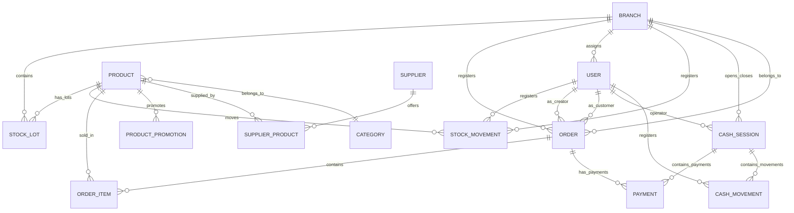

# Domain Model

## Core principle

This is **not** two separate systems. The backoffice (ERP) and the online store (e-commerce) share a single commercial core. Orders, payments, products, stock, and customers are unified entities.

## Conceptual structure

```
Dietetica Lembas
├── Global catalog
│   ├── Products, categories
│   └── Sale price (on the product)
├── Branches
│   ├── Stock by lots with expiration dates
│   ├── Stock movements (traceability)
│   ├── In-store sales (orders with type=POS)
│   └── Online order preparation (orders with type=ONLINE)
└── Unified payments
    ├── Online payments (Mercado Pago Checkout Pro)
    └── In-store payments (associated with cash register)
```

## Entity relationship diagram



## Domain decisions

| Decision | Rationale |
|---|---|
| Available stock = SUM(stock_lots.quantity_available) | Stock lots are the single source of truth. No denormalized stock cache |
| Stock movements serve as traceability | Every stock change generates a record. No silent updates |
| Online and in-store sales share the Order entity | Channel is distinguished by `type` (ONLINE vs POS). Same business rules apply |
| Online and in-store payments share the Payment entity | Shared table for consistent reporting and traceability |
| Cash register controls physical cash only | Other payment methods (QR, transfer, cards) are informational at close time |
| Product snapshots in order items | Ensures accurate historical reports even if prices change later |
| Stock deducted at payment confirmation, not at order creation | No separate reservation table needed. Reversal uses cancellation movements |
