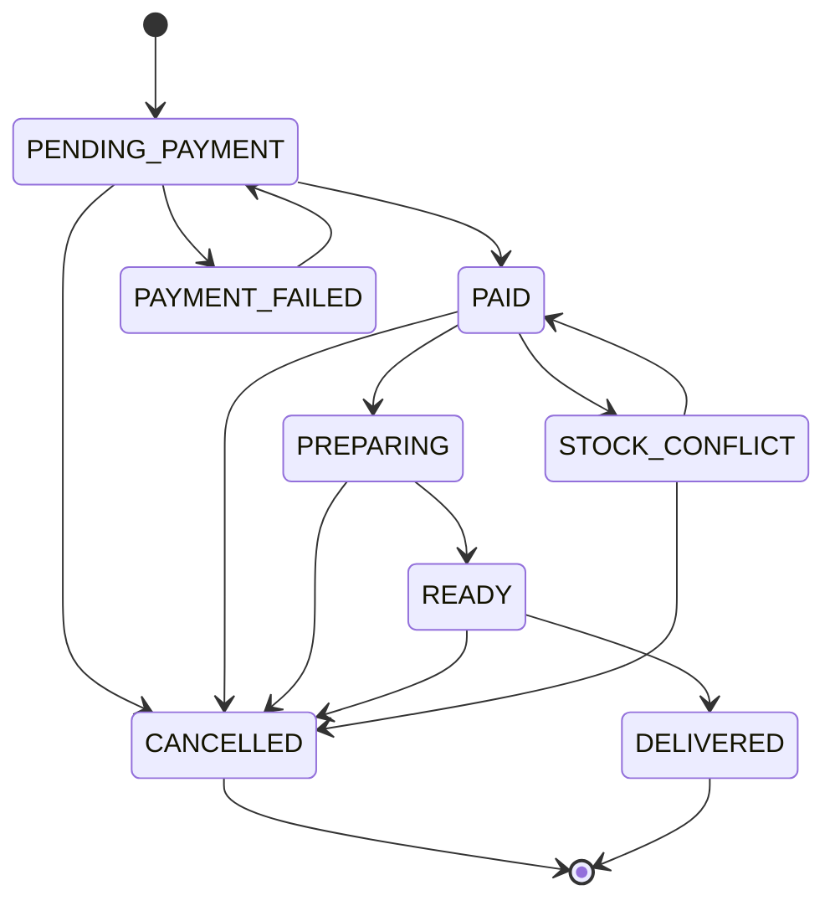
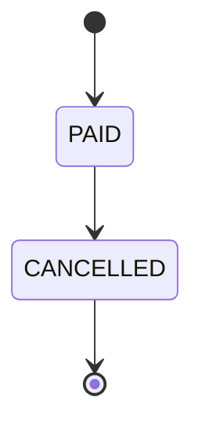
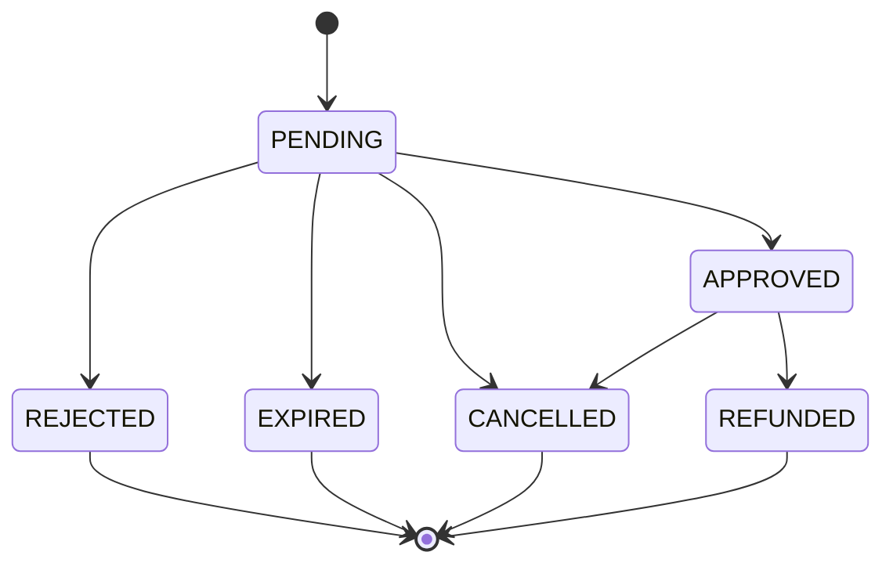
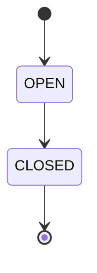
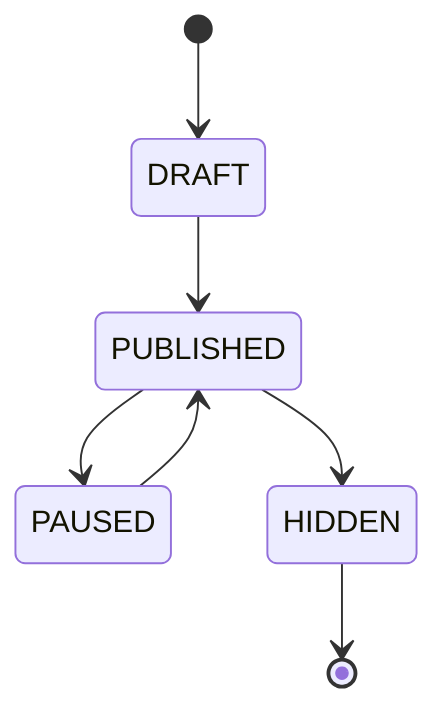

# State Machines

## Order state machine

### ONLINE (e-commerce)

### POS (in-store sale)

### Status reference

| Status | Description | Applies to |
|---|---|---|
| PENDING_PAYMENT | Created, waiting for MP payment | ONLINE |
| PAID | Payment confirmed (online) or sale completed (POS) | ONLINE / POS |
| PREPARING | Employee assembling products | ONLINE |
| READY | Ready for customer pickup | ONLINE |
| DELIVERED | Handed to customer at branch (in-store pickup). NOT home delivery. | ONLINE |
| CANCELLED | Order cancelled | ONLINE / POS |
| PAYMENT_FAILED | Payment rejected by MP | ONLINE |
| STOCK_CONFLICT | Payment approved but insufficient stock | ONLINE |

## Payment state machine

### Status reference

| Status | Description |
|---|---|
| PENDING | Payment created, awaiting confirmation |
| APPROVED | Payment confirmed |
| REJECTED | Payment rejected by provider |
| CANCELLED | Payment cancelled |
| REFUNDED | Refunded to customer |
| EXPIRED | Expired without completion |
| IN_PROCESS | In process (Mercado Pago intermediate state) |

## Cash session state machine

## Product online status

| Status | Description |
|---|---|
| DRAFT | Created, not visible online |
| PUBLISHED | Visible in online store |
| PAUSED | Temporarily hidden |
| HIDDEN | Permanently removed from online catalog |
