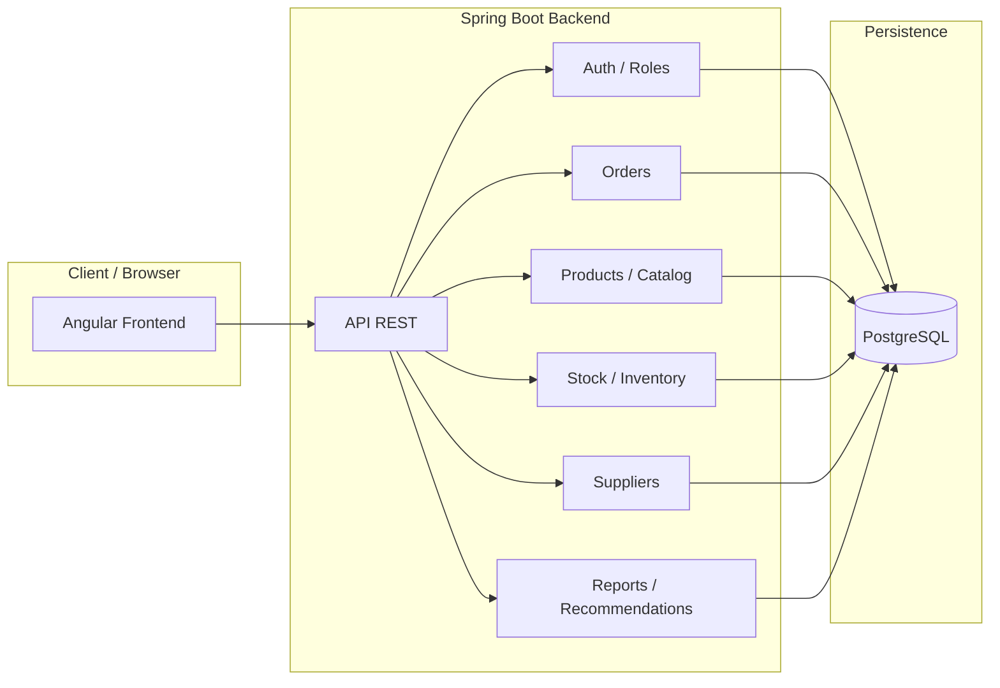

# Architecture Overview

## Architecture style

**Modular monolith** with frontend-backend separation.

```text
Frontend Angular (storefront + backoffice)
    ↓ HTTP REST
Backend Spring Boot (modules by feature)
    ↓ JPA/Hibernate
PostgreSQL 16
```

## Why modular monolith?

| Reason | Detail |
|---|---|
| Single developer | No need for microservice team coordination |
| Low complexity | One deployable unit, simpler debugging |
| Fast development | No inter-service communication overhead |
| Domain separation | Maintained by package structure, not network boundaries |
| Future migration | Modules can be extracted to microservices if needed |

## Architecture diagram



## Technology stack

| Layer | Technology |
|---|---|
| Backend language | Java 21 |
| Backend framework | Spring Boot 3.5.x |
| ORM | Spring Data JPA / Hibernate |
| Database migrations | Flyway |
| Database | PostgreSQL 16 |
| Authentication | JWT (24h tokens) |
| Password hashing | BCrypt |
| API documentation | Springdoc OpenAPI |
| Frontend framework | Angular (standalone components) |
| Frontend state | Signals |
| UI component library | PrimeNG |
| CSS framework | Tailwind CSS |
| Containerization | Docker Compose |
| Reverse proxy | Nginx |
| Testing (backend) | JUnit, Mockito, Testcontainers |
| Testing (frontend) | Jasmine, Karma |

## Module dependency map

```text
auth       -- No dependencies
catalog    -- auth
inventory  -- catalog, auth
orders     -- catalog, inventory, payments, auth
payments   -- orders, cash, auth
cash       -- auth
suppliers  -- catalog, auth
reports    -- catalog, inventory, orders, payments, cash, auth
payments   -- orders, inventory, auth, external Mercado Pago webhook
audit      -- auth
shared     -- (utilized by all modules)
```

## Key architectural decisions

1. **Unified Order model** -- POS and ONLINE sales share the same entity
2. **Unified Payment model** -- Online and in-store payments share the same entity
3. **Stock lots as source of truth** -- No denormalized stock counts
4. **Localized external integrations** -- Mercado Pago calls and webhook handling are kept in the payments module
5. **Pessimistic locking for stock operations** -- SELECT FOR UPDATE to prevent overselling
6. **Stock deducted at payment confirmation** -- Not at order creation, not at delivery
7. **Cash register controls physical cash** -- Other methods are informational at close
