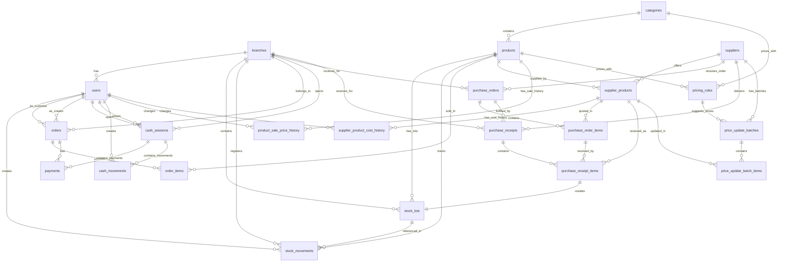

# Database Design

## Engine

PostgreSQL 16

## Principles

1. **Global catalog, stock per branch**: products and categories are global. Stock is tracked in lots per branch.
2. **`stock_lots` as single source of truth**: available stock is `SUM(quantity_available)` from active lots. No `stock_reservations` table.
3. **Purchase orders do not touch stock**: they represent expected purchases.
4. **Purchase receipts touch stock**: confirming a receipt creates stock lots and `PURCHASE_ENTRY` movements.
5. **Unified order**: `orders` handles both POS and ONLINE sales.
6. **Unified payments**: `payments` serves both online and in-store payments.
7. **Operational cash register**: `cash_sessions` represents a shift. In-store sales require an open session.
8. **Current prices are operational fields**: `products.sale_price` and `supplier_products.current_cost` are direct fields for fast queries.
9. **Price history uses dedicated tables**: `product_sale_price_history` and `supplier_product_cost_history` are the source for price reports.
10. **Stock deducted on payment approval**: no reservations. Reversal uses `CANCELLATION_RETURN` movements.
11. **Snapshots in order items**: `order_items` stores product data at time of sale.

## Migration plan (Flyway)

| Migration | Content |
|---|---|
| V1__core.sql | branches, users |
| V2__catalog.sql | categories, products |
| V5__orders.sql | orders, order_items (planned; implemented as V25 in current schema history) |
| V6__payments.sql | payments (planned; implemented as V26 in current schema history) |
| V7__cash.sql | cash_sessions, cash_movements |
| V8__optional_promotions.sql | product_promotions |
| V9__audit.sql | audit_logs |
| V10__seed_data.sql | Demo data |
| V18__inventory.sql | stock_lots, stock_movements |
| V19__inventory_purchasing_links.sql | add supplier and receipt references to stock_lots, add movement reference fields |
| V20__suppliers.sql | suppliers, supplier_products, supplier_product_cost_history |
| V21__seed_suppliers.sql | Demo suppliers and product-supplier associations |
| V22__price_history.sql | product_sale_price_history |
| V23__purchasing.sql | purchase_orders, purchase_order_items, purchase_receipts, purchase_receipt_items |
| V24__pricing_batches.sql | pricing_rules, price_update_batches, price_update_batch_items |
| V25__orders.sql | orders, order_items, order_number_seq, FK from stock_movements.order_id |
| V26__payments.sql | payments |

Migration numbers after V18 can be adjusted to the current database history when implementing. Existing deployed migration numbers must never be reused.

Note: `V5__orders.sql` shown in the original plan was shifted to `V25__orders.sql` because the project had already applied migrations up to `V24` by the time S2-US06 was implemented. Likewise, the planned `V6__payments.sql` is implemented as `V26__payments.sql`.

## Key tables

### Core

```sql
CREATE TABLE branches (
    id BIGSERIAL PRIMARY KEY,
    name VARCHAR(255) NOT NULL,
    address VARCHAR(255),
    phone VARCHAR(50),
    active BOOLEAN DEFAULT true,
    created_at TIMESTAMPTZ DEFAULT now()
);

CREATE TABLE users (
    id BIGSERIAL PRIMARY KEY,
    branch_id BIGINT REFERENCES branches(id),
    email VARCHAR(255) UNIQUE NOT NULL,
    password_hash VARCHAR(255) NOT NULL,
    first_name VARCHAR(100) NOT NULL,
    last_name VARCHAR(100) NOT NULL,
    phone VARCHAR(50),
    role VARCHAR(20) NOT NULL CHECK (role IN ('ADMIN','MANAGER','EMPLOYEE','CUSTOMER')),
    enabled BOOLEAN DEFAULT true,
    created_at TIMESTAMPTZ DEFAULT now(),
    updated_at TIMESTAMPTZ DEFAULT now()
);
```

### Catalog and pricing

```sql
CREATE TABLE categories (
    id BIGSERIAL PRIMARY KEY,
    parent_id BIGINT REFERENCES categories(id),
    name VARCHAR(255) NOT NULL,
    description TEXT
);

CREATE TABLE products (
    id BIGSERIAL PRIMARY KEY,
    category_id BIGINT REFERENCES categories(id),
    name VARCHAR(255) NOT NULL,
    description TEXT,
    brand_name VARCHAR(255),
    barcode VARCHAR(100) UNIQUE,
    online_status VARCHAR(20) DEFAULT 'DRAFT' CHECK (online_status IN ('DRAFT','PUBLISHED','PAUSED','HIDDEN')),
    image_url VARCHAR(500),
    sale_price DECIMAL(12,2) NOT NULL CHECK (sale_price >= 0),
    minimum_stock INT,
    active BOOLEAN DEFAULT true,
    created_at TIMESTAMPTZ DEFAULT now(),
    updated_at TIMESTAMPTZ DEFAULT now()
);

CREATE TABLE product_sale_price_history (
    id BIGSERIAL PRIMARY KEY,
    product_id BIGINT NOT NULL REFERENCES products(id),
    old_price DECIMAL(12,2),
    new_price DECIMAL(12,2) NOT NULL CHECK (new_price >= 0),
    valid_from TIMESTAMPTZ NOT NULL DEFAULT now(),
    valid_to TIMESTAMPTZ,
    reason VARCHAR(100),
    source VARCHAR(50),
    reference_type VARCHAR(50),
    reference_id BIGINT,
    created_by_user_id BIGINT REFERENCES users(id),
    created_at TIMESTAMPTZ DEFAULT now()
);

CREATE TABLE pricing_rules (
    id BIGSERIAL PRIMARY KEY,
    name VARCHAR(100) NOT NULL,
    category_id BIGINT REFERENCES categories(id),
    product_id BIGINT REFERENCES products(id),
    target_margin_percentage DECIMAL(5,2) NOT NULL CHECK (target_margin_percentage >= 0 AND target_margin_percentage < 100),

    active BOOLEAN DEFAULT true,
    priority INT DEFAULT 0,
    created_at TIMESTAMPTZ DEFAULT now(),
    updated_at TIMESTAMPTZ DEFAULT now(),
    CHECK (category_id IS NULL OR product_id IS NULL)
);
```

### Suppliers and cost history

```sql
CREATE TABLE suppliers (
    id BIGSERIAL PRIMARY KEY,
    name VARCHAR(255) NOT NULL,
    contact_name VARCHAR(255),
    phone VARCHAR(50),
    email VARCHAR(255),
    cuit VARCHAR(20) UNIQUE,
    created_at TIMESTAMPTZ DEFAULT now()
);

CREATE TABLE supplier_products (
    id BIGSERIAL PRIMARY KEY,
    product_id BIGINT NOT NULL REFERENCES products(id),
    supplier_id BIGINT NOT NULL REFERENCES suppliers(id),
    supplier_sku VARCHAR(100),
    current_cost DECIMAL(12,2) NOT NULL CHECK (current_cost >= 0),
    is_preferred BOOLEAN DEFAULT false,
    active BOOLEAN DEFAULT true,
    created_at TIMESTAMPTZ DEFAULT now(),
    updated_at TIMESTAMPTZ DEFAULT now(),
    UNIQUE(product_id, supplier_id)
);

CREATE TABLE supplier_product_cost_history (
    id BIGSERIAL PRIMARY KEY,
    supplier_product_id BIGINT NOT NULL REFERENCES supplier_products(id),
    old_cost DECIMAL(12,2),
    new_cost DECIMAL(12,2) NOT NULL CHECK (new_cost >= 0),
    valid_from TIMESTAMPTZ NOT NULL DEFAULT now(),
    valid_to TIMESTAMPTZ,
    source VARCHAR(50),
    reference_type VARCHAR(50),
    reference_id BIGINT,
    created_by_user_id BIGINT REFERENCES users(id),
    created_at TIMESTAMPTZ DEFAULT now()
);
```

### Purchasing

```sql
CREATE TABLE purchase_orders (
    id BIGSERIAL PRIMARY KEY,
    supplier_id BIGINT NOT NULL REFERENCES suppliers(id),
    branch_id BIGINT NOT NULL REFERENCES branches(id),
    status VARCHAR(30) NOT NULL CHECK (status IN ('DRAFT','CONFIRMED','SENT','PARTIALLY_RECEIVED','RECEIVED','CANCELLED')),
    order_date TIMESTAMPTZ NOT NULL DEFAULT now(),
    expected_delivery_date DATE,
    notes TEXT,
    created_by_user_id BIGINT REFERENCES users(id),
    created_at TIMESTAMPTZ DEFAULT now(),
    confirmed_at TIMESTAMPTZ,
    sent_at TIMESTAMPTZ,
    cancelled_at TIMESTAMPTZ
);

CREATE TABLE purchase_order_items (
    id BIGSERIAL PRIMARY KEY,
    purchase_order_id BIGINT NOT NULL REFERENCES purchase_orders(id),
    product_id BIGINT NOT NULL REFERENCES products(id),
    supplier_product_id BIGINT REFERENCES supplier_products(id),
    quantity_ordered DECIMAL(12,3) NOT NULL CHECK (quantity_ordered > 0),
    unit_cost DECIMAL(12,2) NOT NULL CHECK (unit_cost >= 0),
    subtotal DECIMAL(12,2) NOT NULL CHECK (subtotal >= 0),
    created_at TIMESTAMPTZ DEFAULT now()
);

CREATE TABLE purchase_receipts (
    id BIGSERIAL PRIMARY KEY,
    purchase_order_id BIGINT REFERENCES purchase_orders(id),
    supplier_id BIGINT NOT NULL REFERENCES suppliers(id),
    branch_id BIGINT NOT NULL REFERENCES branches(id),
    status VARCHAR(30) NOT NULL CHECK (status IN ('DRAFT','CONFIRMED','CANCELLED')),
    invoice_number VARCHAR(100),
    received_at TIMESTAMPTZ,
    received_by_user_id BIGINT REFERENCES users(id),
    notes TEXT,
    created_at TIMESTAMPTZ DEFAULT now(),
    confirmed_at TIMESTAMPTZ
);

CREATE TABLE purchase_receipt_items (
    id BIGSERIAL PRIMARY KEY,
    purchase_receipt_id BIGINT NOT NULL REFERENCES purchase_receipts(id),
    purchase_order_item_id BIGINT REFERENCES purchase_order_items(id),
    product_id BIGINT NOT NULL REFERENCES products(id),
    supplier_product_id BIGINT REFERENCES supplier_products(id),
    quantity_received DECIMAL(12,3) NOT NULL CHECK (quantity_received > 0),
    unit_cost DECIMAL(12,2) NOT NULL CHECK (unit_cost >= 0),
    expiration_date DATE,
    lot_code VARCHAR(100),
    created_stock_lot_id BIGINT,
    created_at TIMESTAMPTZ DEFAULT now()
);
```

### Inventory

```sql
CREATE TABLE stock_lots (
    id BIGSERIAL PRIMARY KEY,
    product_id BIGINT NOT NULL REFERENCES products(id),
    branch_id BIGINT NOT NULL REFERENCES branches(id),
    supplier_id BIGINT REFERENCES suppliers(id),
    supplier_product_id BIGINT REFERENCES supplier_products(id),
    purchase_receipt_id BIGINT REFERENCES purchase_receipts(id),
    purchase_receipt_item_id BIGINT REFERENCES purchase_receipt_items(id),
    lot_code VARCHAR(100),
    expiration_date DATE,
    initial_quantity DECIMAL(12,3) NOT NULL CHECK (initial_quantity > 0),
    quantity_available DECIMAL(12,3) NOT NULL CHECK (quantity_available >= 0),
    unit_cost DECIMAL(12,2) NOT NULL CHECK (unit_cost >= 0),
    status VARCHAR(20) NOT NULL DEFAULT 'ACTIVE' CHECK (status IN ('ACTIVE','DEPLETED','CANCELLED')),
    created_at TIMESTAMPTZ DEFAULT now()
);

CREATE TABLE stock_movements (
    id BIGSERIAL PRIMARY KEY,
    product_id BIGINT NOT NULL REFERENCES products(id),
    branch_id BIGINT NOT NULL REFERENCES branches(id),
    stock_lot_id BIGINT REFERENCES stock_lots(id),
    type VARCHAR(50) NOT NULL CHECK (type IN ('PURCHASE_ENTRY','POS_SALE','ONLINE_SALE','CANCELLATION_RETURN','MANUAL_ADJUSTMENT','WASTE','INTERNAL_CONSUMPTION','TRANSFER_OUT','TRANSFER_IN')),
    quantity DECIMAL(12,3) NOT NULL,
    unit_cost_snapshot DECIMAL(12,2),
    reason TEXT,
    reference_type VARCHAR(50),
    reference_id BIGINT,
    order_id BIGINT REFERENCES orders(id),
    created_by_user_id BIGINT REFERENCES users(id),
    created_at TIMESTAMPTZ DEFAULT now()
);
```

### Price update batches

```sql
CREATE TABLE price_update_batches (
    id BIGSERIAL PRIMARY KEY,
    supplier_id BIGINT REFERENCES suppliers(id),
    type VARCHAR(30) NOT NULL CHECK (type IN ('SUPPLIER_FILE','PERCENTAGE_INCREASE','MANUAL_GRID','SINGLE_PRODUCT_MANUAL')),
    status VARCHAR(30) NOT NULL CHECK (status IN ('DRAFT','VALIDATED','APPLIED','CANCELLED')),
    source_file_name VARCHAR(255),
    default_new_product_margin_percentage DECIMAL(5,2),

    apply_cost_updates_by_default BOOLEAN DEFAULT true,
    apply_sale_price_updates_by_default BOOLEAN DEFAULT true,
    pricing_rule_id BIGINT REFERENCES pricing_rules(id),
    created_by_user_id BIGINT REFERENCES users(id),
    created_at TIMESTAMPTZ DEFAULT now(),
    applied_at TIMESTAMPTZ,
    cancelled_at TIMESTAMPTZ,
    notes TEXT
);

CREATE TABLE price_update_batch_items (
    id BIGSERIAL PRIMARY KEY,
    batch_id BIGINT NOT NULL REFERENCES price_update_batches(id),
    supplier_product_id BIGINT REFERENCES supplier_products(id),
    product_id BIGINT REFERENCES products(id),
    supplier_sku VARCHAR(100),
    supplier_product_name VARCHAR(255),
    barcode VARCHAR(100),
    old_cost DECIMAL(12,2),
    new_cost DECIMAL(12,2),
    supplier_variation_percentage DECIMAL(8,3),
    new_product_margin_percentage DECIMAL(5,2),
    old_sale_price DECIMAL(12,2),
    suggested_sale_price DECIMAL(12,2),
    final_sale_price DECIMAL(12,2),
    apply_cost_update BOOLEAN DEFAULT true,
    apply_sale_price_update BOOLEAN DEFAULT true,
    create_product BOOLEAN DEFAULT false,
    status VARCHAR(30) NOT NULL CHECK (status IN ('CREATE','UPDATE','UNCHANGED','REVIEW','EXCLUDED','ERROR')),
    error_message TEXT
);
```

### Orders

> Note: `DELIVERED` means handed to customer at branch for pickup. It does NOT imply home delivery.

```sql
CREATE TABLE orders (
    id BIGSERIAL PRIMARY KEY,
    order_number VARCHAR(50) UNIQUE NOT NULL,
    type VARCHAR(20) NOT NULL CHECK (type IN ('POS','ONLINE')),
    status VARCHAR(30) NOT NULL CHECK (status IN ('PENDING_PAYMENT','PAID','PREPARING','READY','DELIVERED','CANCELLED','PAYMENT_FAILED','STOCK_CONFLICT')),
    branch_id BIGINT NOT NULL REFERENCES branches(id),
    customer_user_id BIGINT REFERENCES users(id),
    created_by_user_id BIGINT REFERENCES users(id),
    customer_name_snapshot VARCHAR(255),
    customer_email_snapshot VARCHAR(255),
    customer_phone_snapshot VARCHAR(50),
    fulfillment_type VARCHAR(20) DEFAULT 'PICKUP' CHECK (fulfillment_type IN ('PICKUP')),
    subtotal DECIMAL(12,2) NOT NULL CHECK (subtotal >= 0),
    discount_total DECIMAL(12,2) DEFAULT 0 CHECK (discount_total >= 0),
    total DECIMAL(12,2) NOT NULL CHECK (total >= 0),
    notes TEXT,
    paid_at TIMESTAMPTZ,
    prepared_at TIMESTAMPTZ,
    delivered_at TIMESTAMPTZ,
    cancelled_at TIMESTAMPTZ,
    cancellation_reason TEXT,
    created_at TIMESTAMPTZ DEFAULT now(),
    updated_at TIMESTAMPTZ DEFAULT now()
);

CREATE TABLE order_items (
    id BIGSERIAL PRIMARY KEY,
    order_id BIGINT REFERENCES orders(id),
    product_id BIGINT REFERENCES products(id),
    quantity DECIMAL(12,3) NOT NULL CHECK (quantity > 0),
    unit_price DECIMAL(12,2) NOT NULL CHECK (unit_price >= 0),
    discount_amount DECIMAL(12,2) DEFAULT 0,
    subtotal_amount DECIMAL(12,2) NOT NULL CHECK (subtotal_amount >= 0),
    product_name_snapshot VARCHAR(255) NOT NULL,
    product_barcode_snapshot VARCHAR(100),
    cost_price_snapshot DECIMAL(12,2),
    created_at TIMESTAMPTZ DEFAULT now()
);
```

### Payments

```sql
CREATE TABLE payments (
    id BIGSERIAL PRIMARY KEY,
    order_id BIGINT REFERENCES orders(id) NOT NULL,
    cash_session_id BIGINT,
    provider VARCHAR(50) NOT NULL CHECK (provider IN ('MERCADO_PAGO','MANUAL','BANK','CARD_TERMINAL')),
    method VARCHAR(50) NOT NULL CHECK (method IN ('CHECKOUT_PRO','CASH','QR','TRANSFER','DEBIT_CARD','CREDIT_CARD','OTHER')),
    status VARCHAR(20) NOT NULL CHECK (status IN ('PENDING','APPROVED','REJECTED','CANCELLED','REFUNDED','EXPIRED','IN_PROCESS')),
    amount DECIMAL(12,2) NOT NULL CHECK (amount > 0),
    currency VARCHAR(3) DEFAULT 'ARS',
    provider_payment_id VARCHAR(255),
    provider_preference_id VARCHAR(255),
    external_reference VARCHAR(255),
    approved_at TIMESTAMPTZ,
    metadata JSONB,
    created_at TIMESTAMPTZ DEFAULT now(),
    updated_at TIMESTAMPTZ DEFAULT now()
);
```

`cash_session_id` is intentionally stored as a scalar reference in `V26__payments.sql`
until the cash module creates `cash_sessions`. The FK should be added by the cash
migration once that table exists.

### Cash register

```sql
CREATE TABLE cash_sessions (
    id BIGSERIAL PRIMARY KEY,
    branch_id BIGINT REFERENCES branches(id) NOT NULL,
    opened_by_user_id BIGINT REFERENCES users(id) NOT NULL,
    closed_by_user_id BIGINT REFERENCES users(id),
    opened_at TIMESTAMPTZ DEFAULT now(),
    closed_at TIMESTAMPTZ,
    opening_cash_amount DECIMAL(12,2) NOT NULL CHECK (opening_cash_amount >= 0),
    expected_cash_amount DECIMAL(12,2),
    counted_cash_amount DECIMAL(12,2),
    cash_difference_amount DECIMAL(12,2),
    cash_difference_reason TEXT,
    status VARCHAR(10) NOT NULL DEFAULT 'OPEN' CHECK (status IN ('OPEN','CLOSED')),
    opening_notes TEXT,
    closing_notes TEXT,
    created_at TIMESTAMPTZ DEFAULT now(),
    updated_at TIMESTAMPTZ DEFAULT now()
);

CREATE TABLE cash_movements (
    id BIGSERIAL PRIMARY KEY,
    cash_session_id BIGINT REFERENCES cash_sessions(id) NOT NULL,
    created_by_user_id BIGINT REFERENCES users(id) NOT NULL,
    type VARCHAR(20) NOT NULL CHECK (type IN ('CASH_IN','CASH_OUT','ADJUSTMENT')),
    method VARCHAR(20) NOT NULL CHECK (method IN ('CASH','TRANSFER','OTHER')),
    amount DECIMAL(12,2) NOT NULL,
    reason TEXT NOT NULL,
    created_at TIMESTAMPTZ DEFAULT now()
);
```

### Audit

```sql
CREATE TABLE audit_logs (
    id BIGSERIAL PRIMARY KEY,
    user_id BIGINT REFERENCES users(id),
    action VARCHAR(100) NOT NULL,
    entity_type VARCHAR(100) NOT NULL,
    entity_id BIGINT,
    description TEXT,
    created_at TIMESTAMPTZ DEFAULT now()
);
```

`audit_logs` records critical actors and actions, while dedicated price history tables are used for commercial price history queries.

## Key constraints

| Table | Constraint | Reason |
|---|---|---|
| products | barcode UNIQUE | Unique barcode |
| products | sale_price >= 0 | Non-negative sale price |
| product_sale_price_history | new_price >= 0 | Valid sale price history |
| supplier_products | UNIQUE(product_id, supplier_id) | Avoid duplicate supplier associations |
| supplier_products | current_cost >= 0 | Non-negative replacement cost |
| supplier_product_cost_history | new_cost >= 0 | Valid replacement cost history |
| purchase_order_items | quantity_ordered > 0 | Valid expected purchase quantity |
| purchase_receipt_items | quantity_received > 0 | Valid received quantity |
| stock_lots | initial_quantity > 0, quantity_available >= 0 | Valid physical stock |
| stock_lots | unit_cost >= 0 | Valid frozen lot cost |
| order_items | quantity > 0, unit_price >= 0, subtotal_amount >= 0 | Consistency |
| orders | branch_id NOT NULL, total >= 0, order_number UNIQUE | Consistency |
| payments | amount > 0 | Positive amount |
| cash_sessions | Only one OPEN per branch | Register integrity, enforced by application logic or partial index |
| suppliers | cuit UNIQUE | Unique CUIT |

## Key indexes

| Table | Index | Purpose |
|---|---|---|
| stock_lots | (product_id, branch_id, status, expiration_date) | FEFO queries |
| stock_lots | (expiration_date) | Expiry alerts |
| stock_lots | (purchase_receipt_id) | Trace stock from receipt |
| stock_movements | (product_id, created_at) | Product movement history |
| stock_movements | (order_id) | Movements by order |
| stock_movements | (reference_type, reference_id) | Generic source traceability |
| products | (barcode) | Barcode search |
| products | (category_id) | Category filter |
| products | (online_status) | Public catalog |
| product_sale_price_history | (product_id, valid_from) | Price history lookup |
| supplier_product_cost_history | (supplier_product_id, valid_from) | Cost history lookup |
| purchase_orders | (supplier_id, status) | Supplier order management |
| purchase_receipts | (purchase_order_id) | Receipts by order |
| price_update_batches | (supplier_id, status) | Batch management |
| orders | (branch_id, created_at) | Branch orders |
| orders | (status) | Status filter |
| orders | (type) | POS/ONLINE filter |
| payments | (order_id) | Payments by order |
| payments | (cash_session_id) | Payments by cash session |
| payments | (provider_payment_id) | Mercado Pago lookup |
| cash_sessions | (branch_id, status) | Active session |
| suppliers | (name) | Supplier search |
| supplier_products | (product_id) | Products by supplier |
| supplier_products | (supplier_id) | Suppliers by product |

## Entity-relationship diagram


