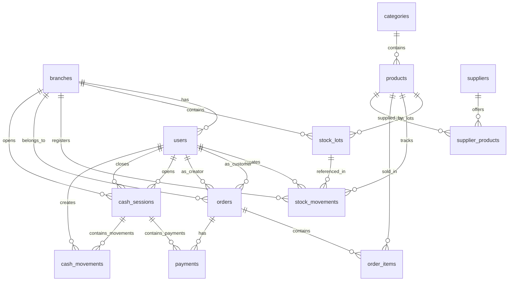

# Database Design

## Engine

PostgreSQL 16

## Principles

1. **Global catalog, stock per branch**: products and categories are global. Stock is in lots per branch.
2. **stock_lots as single source of truth**: available = SUM(quantity_available) from active lots. No stock_reservations table.
3. **Unified order**: `orders` handles both POS and ONLINE sales.
4. **Unified payments**: `payments` serves both online (MP) and in-store (cash register).
5. **Operational cash register**: cash_sessions represents a shift. In-store sales require an open session.
6. **Price on the product**: `products.sale_price` is direct. History in audit_logs.
7. **Role as direct field**: `users.role`. No roles or user_roles tables.
8. **Stock deducted on payment approval**: no reservations. Reversed with CANCELLATION_RETURN movement.
9. **Snapshots in order items**: order_items stores product data at time of sale.

## Migration plan (Flyway)

| Migration | Content |
|---|---|
| V1__core.sql | branches, users |
| V2__catalog.sql | categories, products |
| V3__suppliers.sql | suppliers, supplier_products |
| V4__inventory.sql | stock_lots, stock_movements |
| V5__orders.sql | orders, order_items |
| V6__payments.sql | payments |
| V7__cash.sql | cash_sessions, cash_movements |
| V8__optional_promotions.sql | product_promotions |
| V9__audit.sql | audit_logs |
| V10__seed_data.sql | Demo data |

## Key tables

### Core

```sql
CREATE TABLE branches (
    id BIGSERIAL PRIMARY KEY,
    name VARCHAR(255) NOT NULL,
    address VARCHAR(255),
    phone VARCHAR(50),
    active BOOLEAN DEFAULT true,
    created_at TIMESTAMP DEFAULT NOW()
);

CREATE TABLE users (
    id BIGSERIAL PRIMARY KEY,
    branch_id BIGINT REFERENCES branches(id),
    email VARCHAR(255) UNIQUE NOT NULL,
    password_hash VARCHAR(255) NOT NULL,
    first_name VARCHAR(100) NOT NULL,
    last_name VARCHAR(100) NOT NULL,
    phone VARCHAR(50),
    role VARCHAR(20) NOT NULL CHECK (role IN ('ADMIN','MANAGER','EMPLOYEE','CUSTOMER')),
    enabled BOOLEAN DEFAULT true,
    created_at TIMESTAMP DEFAULT NOW(),
    updated_at TIMESTAMP DEFAULT NOW()
);
```

### Catalog

```sql
CREATE TABLE categories (
    id BIGSERIAL PRIMARY KEY,
    parent_id BIGINT REFERENCES categories(id),
    name VARCHAR(255) NOT NULL,
    description TEXT
);

CREATE TABLE products (
    id BIGSERIAL PRIMARY KEY,
    category_id BIGINT REFERENCES categories(id),
    name VARCHAR(255) NOT NULL,
    description TEXT,
    brand_name VARCHAR(255),
    barcode VARCHAR(100) UNIQUE,
    online_status VARCHAR(20) DEFAULT 'DRAFT' CHECK (online_status IN ('DRAFT','PUBLISHED','PAUSED','HIDDEN')),
    image_url VARCHAR(500),
    sale_price DECIMAL(12,2) NOT NULL CHECK (sale_price >= 0),
    minimum_stock INT,
    active BOOLEAN DEFAULT true,
    created_at TIMESTAMP DEFAULT NOW(),
    updated_at TIMESTAMP DEFAULT NOW()
);
```

### Suppliers

```sql
CREATE TABLE suppliers (
    id BIGSERIAL PRIMARY KEY,
    name VARCHAR(255) NOT NULL,
    contact_name VARCHAR(255),
    phone VARCHAR(50),
    email VARCHAR(255),
    cuit VARCHAR(20) UNIQUE,
    created_at TIMESTAMP DEFAULT NOW()
);

CREATE TABLE supplier_products (
    id BIGSERIAL PRIMARY KEY,
    product_id BIGINT REFERENCES products(id),
    supplier_id BIGINT REFERENCES suppliers(id),
    supplier_sku VARCHAR(100),
    current_cost DECIMAL(12,2) NOT NULL CHECK (current_cost >= 0),
    is_preferred BOOLEAN DEFAULT false,
    created_at TIMESTAMP DEFAULT NOW(),
    updated_at TIMESTAMP DEFAULT NOW(),
    UNIQUE(product_id, supplier_id)
);
```

### Inventory

```sql
CREATE TABLE stock_lots (
    id BIGSERIAL PRIMARY KEY,
    product_id BIGINT REFERENCES products(id),
    branch_id BIGINT REFERENCES branches(id),
    lot_code VARCHAR(100),
    expiration_date DATE,
    quantity_available DECIMAL(12,3) NOT NULL CHECK (quantity_available >= 0),
    cost_price DECIMAL(12,2) CHECK (cost_price >= 0),
    created_at TIMESTAMP DEFAULT NOW()
);

CREATE TABLE stock_movements (
    id BIGSERIAL PRIMARY KEY,
    product_id BIGINT REFERENCES products(id),
    branch_id BIGINT REFERENCES branches(id),
    stock_lot_id BIGINT REFERENCES stock_lots(id),
    type VARCHAR(50) NOT NULL CHECK (type IN ('PURCHASE_ENTRY','POS_SALE','ONLINE_SALE','CANCELLATION_RETURN','MANUAL_ADJUSTMENT','WASTE','INTERNAL_CONSUMPTION')),
    quantity DECIMAL(12,3) NOT NULL,
    reason TEXT,
    order_id BIGINT REFERENCES orders(id),
    created_by_user_id BIGINT REFERENCES users(id),
    created_at TIMESTAMP DEFAULT NOW()
);
```

### Orders

> Note: `DELIVERED` means handed to customer at branch for pickup. It does NOT imply home delivery.

```sql
CREATE TABLE orders (
    id BIGSERIAL PRIMARY KEY,
    order_number VARCHAR(50) UNIQUE NOT NULL,
    type VARCHAR(20) NOT NULL CHECK (type IN ('POS','ONLINE')),
    status VARCHAR(30) NOT NULL CHECK (status IN ('PENDING_PAYMENT','PAID','PREPARING','READY','DELIVERED','CANCELLED','PAYMENT_FAILED','STOCK_CONFLICT')),
    branch_id BIGINT REFERENCES branches(id),
    customer_user_id BIGINT REFERENCES users(id),
    created_by_user_id BIGINT REFERENCES users(id),
    customer_name_snapshot VARCHAR(255),
    customer_email_snapshot VARCHAR(255),
    customer_phone_snapshot VARCHAR(50),
    fulfillment_type VARCHAR(20) DEFAULT 'PICKUP' CHECK (fulfillment_type IN ('PICKUP')),
    subtotal DECIMAL(12,2) NOT NULL CHECK (subtotal >= 0),
    discount_total DECIMAL(12,2) DEFAULT 0 CHECK (discount_total >= 0),
    total DECIMAL(12,2) NOT NULL CHECK (total >= 0),
    notes TEXT,
    paid_at TIMESTAMP,
    prepared_at TIMESTAMP,
    delivered_at TIMESTAMP,
    cancelled_at TIMESTAMP,
    cancellation_reason TEXT,
    created_at TIMESTAMP DEFAULT NOW(),
    updated_at TIMESTAMP DEFAULT NOW()
);

CREATE TABLE order_items (
    id BIGSERIAL PRIMARY KEY,
    order_id BIGINT REFERENCES orders(id),
    product_id BIGINT REFERENCES products(id),
    quantity DECIMAL(12,3) NOT NULL CHECK (quantity > 0),
    unit_price DECIMAL(12,2) NOT NULL CHECK (unit_price >= 0),
    discount_amount DECIMAL(12,2) DEFAULT 0,
    subtotal_amount DECIMAL(12,2) NOT NULL CHECK (subtotal_amount >= 0),
    product_name_snapshot VARCHAR(255) NOT NULL,
    product_barcode_snapshot VARCHAR(100),
    cost_price_snapshot DECIMAL(12,2),
    created_at TIMESTAMP DEFAULT NOW()
);
```

### Payments

```sql
CREATE TABLE payments (
    id BIGSERIAL PRIMARY KEY,
    order_id BIGINT REFERENCES orders(id) NOT NULL,
    cash_session_id BIGINT REFERENCES cash_sessions(id),
    provider VARCHAR(50) NOT NULL CHECK (provider IN ('MERCADO_PAGO','MANUAL','BANK','CARD_TERMINAL')),
    method VARCHAR(50) NOT NULL CHECK (method IN ('CHECKOUT_PRO','CASH','QR','TRANSFER','DEBIT_CARD','CREDIT_CARD','OTHER')),
    status VARCHAR(20) NOT NULL CHECK (status IN ('PENDING','APPROVED','REJECTED','CANCELLED','REFUNDED','EXPIRED','IN_PROCESS')),
    amount DECIMAL(12,2) NOT NULL CHECK (amount > 0),
    currency VARCHAR(3) DEFAULT 'ARS',
    provider_payment_id VARCHAR(255),
    provider_preference_id VARCHAR(255),
    external_reference VARCHAR(255),
    approved_at TIMESTAMP,
    metadata JSONB,
    created_at TIMESTAMP DEFAULT NOW(),
    updated_at TIMESTAMP DEFAULT NOW()
);
```

### Cash register

```sql
CREATE TABLE cash_sessions (
    id BIGSERIAL PRIMARY KEY,
    branch_id BIGINT REFERENCES branches(id) NOT NULL,
    opened_by_user_id BIGINT REFERENCES users(id) NOT NULL,
    closed_by_user_id BIGINT REFERENCES users(id),
    opened_at TIMESTAMP DEFAULT NOW(),
    closed_at TIMESTAMP,
    opening_cash_amount DECIMAL(12,2) NOT NULL CHECK (opening_cash_amount >= 0),
    expected_cash_amount DECIMAL(12,2),
    counted_cash_amount DECIMAL(12,2),
    cash_difference_amount DECIMAL(12,2),
    cash_difference_reason TEXT,
    status VARCHAR(10) NOT NULL DEFAULT 'OPEN' CHECK (status IN ('OPEN','CLOSED')),
    opening_notes TEXT,
    closing_notes TEXT,
    created_at TIMESTAMP DEFAULT NOW(),
    updated_at TIMESTAMP DEFAULT NOW()
);

CREATE TABLE cash_movements (
    id BIGSERIAL PRIMARY KEY,
    cash_session_id BIGINT REFERENCES cash_sessions(id) NOT NULL,
    created_by_user_id BIGINT REFERENCES users(id) NOT NULL,
    type VARCHAR(20) NOT NULL CHECK (type IN ('CASH_IN','CASH_OUT','ADJUSTMENT')),
    method VARCHAR(20) NOT NULL CHECK (method IN ('CASH','TRANSFER','OTHER')),
    amount DECIMAL(12,2) NOT NULL,
    reason TEXT NOT NULL,
    created_at TIMESTAMP DEFAULT NOW()
);
```

### Audit

```sql
CREATE TABLE audit_logs (
    id BIGSERIAL PRIMARY KEY,
    user_id BIGINT REFERENCES users(id),
    action VARCHAR(100) NOT NULL,
    entity_type VARCHAR(100) NOT NULL,
    entity_id BIGINT,
    description TEXT,
    created_at TIMESTAMP DEFAULT NOW()
);
```

## Key constraints

| Table | Constraint | Reason |
|---|---|---|
| products | barcode UNIQUE | Unique barcode |
| products | sale_price >= 0 | Non-negative price |
| stock_lots | quantity_available >= 0 | Never negative stock |
| order_items | quantity > 0, unit_price >= 0, subtotal_amount >= 0 | Consistency |
| orders | total >= 0, order_number UNIQUE | Consistency |
| payments | amount > 0 | Positive amount |
| cash_sessions | Only one OPEN per branch (application logic) | Register integrity |
| suppliers | cuit UNIQUE | Unique CUIT |
| supplier_products | (product_id, supplier_id) | Avoid duplicate associations |

## Key indexes

| Table | Index | Purpose |
|---|---|---|
| stock_lots | (product_id, branch_id, expiration_date) | FEFO queries |
| stock_lots | (expiration_date) | Expiry alerts |
| stock_movements | (product_id, created_at) | Product history |
| stock_movements | (order_id) | Movements by order |
| products | (barcode) | Barcode search |
| products | (category_id) | Category filter |
| products | (online_status) | Public catalog |
| orders | (branch_id, created_at) | Branch orders |
| orders | (status) | Status filter |
| orders | (type) | POS/ONLINE filter |
| payments | (order_id) | Payments by order |
| payments | (cash_session_id) | Payments by cash session |
| payments | (provider_payment_id) | MP lookup |
| cash_sessions | (branch_id, status) | Active session |
| suppliers | (name) | Supplier search |
| supplier_products | (product_id) | Products by supplier |
| supplier_products | (supplier_id) | Suppliers by product |

## Entity-relationship diagram


