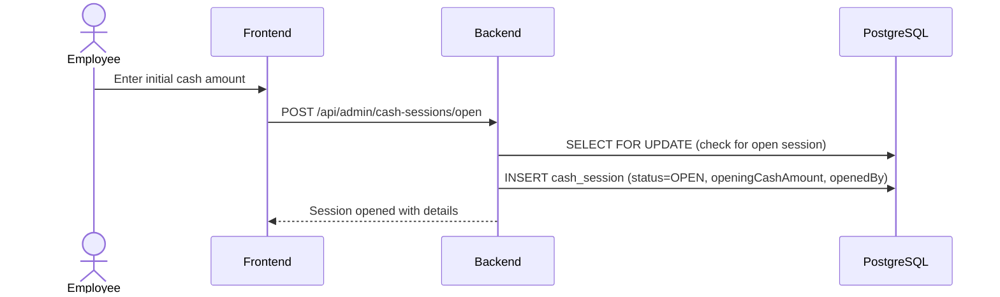
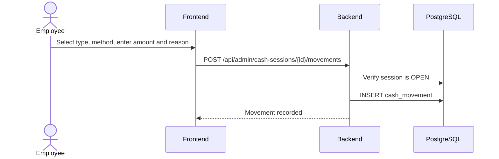
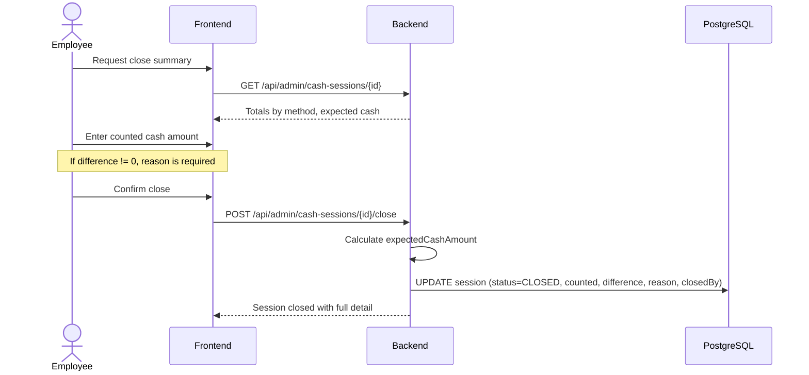

# Process: Cash Opening and Closing

## Cash register lifecycle

```text
OPEN → (sales + movements) → CLOSE
```

## Opening flow



### Opening rules

- Any authorized employee (ADMIN, MANAGER, EMPLOYEE) can open
- Only one OPEN session per branch at a time
- Required: openingCashAmount (>= 0)
- Optional: openingNotes

## Manual movements during session



### Movement types

| Type | Description |
|---|---|
| CASH_IN | Cash entering the drawer |
| CASH_OUT | Cash leaving the drawer |
| ADJUSTMENT | Correction without physical movement |

### Movement rules

- Session must be OPEN
- Reason is mandatory
- Amount must be != 0
- Movement is associated with the creating user

## Closing flow



### Close calculation

```text
expectedCashAmount = openingCashAmount
                   + SUM(payments WHERE method=CASH AND status=APPROVED)
                   + SUM(cash_movements WHERE type=CASH_IN AND method=CASH)
                   - SUM(cash_movements WHERE type=CASH_OUT AND method=CASH)
                   + SUM(cash_movements WHERE type=ADJUSTMENT AND method=CASH)

cashDifference = countedCashAmount - expectedCashAmount
```

### Convention notes

- `expectedCashAmount` only considers CASH-method movements; QR, TRANSFER and
  CARD payments are reported in the `totalsByMethod` breakdown for the close
  report but do not affect the drawer.
- `cashDifference` follows the formula `counted - expected`: a positive value
  means the drawer has more cash than expected ("sobrante"), a negative value
  means less ("faltante"), zero means "cuadra exacto".
- When `cashDifference != 0`, `cashDifferenceReason` is mandatory (enforced by
  `CASH_DIFFERENCE_REASON_REQUIRED` 400 in the backend and revalidated on the
  FE before submit). The session still closes anyway.
- The close endpoint (`POST /api/admin/cash-sessions/{id}/close`) returns the
  full `CashSessionDto` with `status=CLOSED`, the close metadata, the entries
  timeline and a `totalsByMethod` breakdown (`paymentsByMethod` and
  `movementsByMethod`).

### Close rules

- Any authorized employee can close, even if not the same person who opened
- If cashDifference != 0, cash_difference_reason is mandatory
- The session closes regardless of the discrepancy
- After closing, no more operations can be added
- Both opened_by and closed_by users are recorded

### Close report

The closing report shows:

```
Opening cash amount:     $X
Expected cash:           $Y
Counted cash:            $Z
Difference:              $Z - $Y
Difference reason:       (if applicable)

Totals by payment method:
  CASH:          $A  (affects expected cash)
  QR:            $B  (informational)
  TRANSFER:      $C  (informational)
  DEBIT_CARD:    $D  (informational)
  CREDIT_CARD:   $E  (informational)

Manual movements:
  CASH_IN:       $F
  CASH_OUT:      $G
  ADJUSTMENTS:   $H
```
