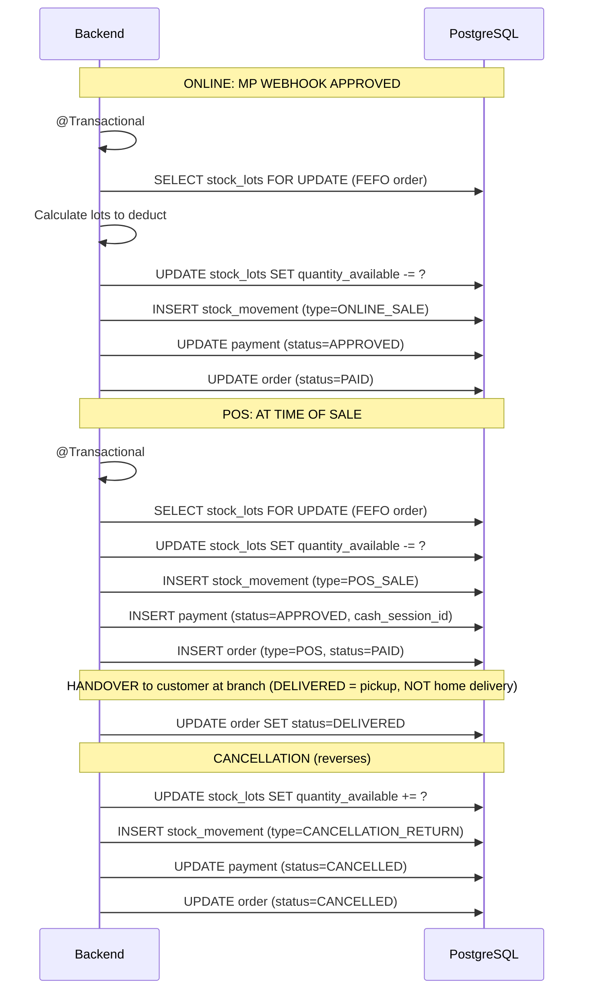

# Process: Stock Reservation (FEFO Deduction)

> There is no stock reservation in the MVP. Stock is deducted only when payment is confirmed.

## Flow

## Stock state example

| Moment | Lot A | Lot B | Total |
|---|---|---|---|
| Before order | 10 | 5 | 15 |
| Payment approved (deduct 3 from A) | 7 | 5 | 12 |
| Delivered | 7 | 5 | 12 |
| Cancelled (reversed to A) | 10 | 5 | 15 |

## Rules

| Rule | Description |
|---|---|
| Stock deducted on payment approval | Not at order creation, not at delivery |
| FEFO ordering | Lot expiring first is deducted first |
| Cancellation reverses to the same lots | Uses original stock_movements as reference |
| If payment approved but no stock | Order goes to STOCK_CONFLICT, manual review |
