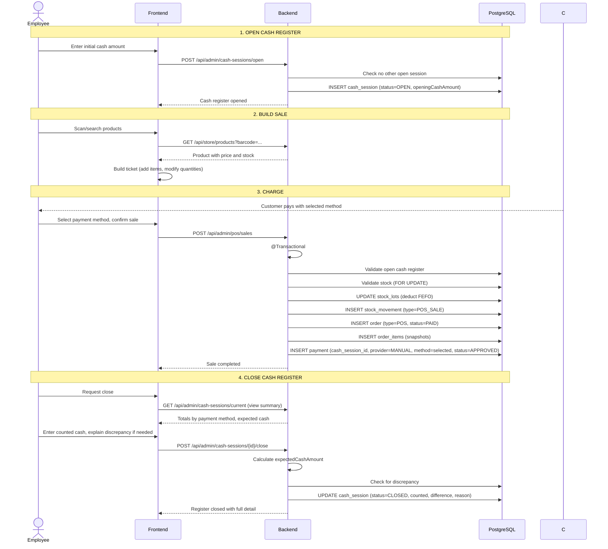

# Process: In-Store Sale (POS)

## Flow



## Cash close calculation

```text
expectedCashAmount = openingCashAmount
                   + SUM(payments WHERE method=CASH AND status=APPROVED)
                   + SUM(cash_movements WHERE type=CASH_IN AND method=CASH)
                   - SUM(cash_movements WHERE type=CASH_OUT AND method=CASH)

cashDifference = countedCashAmount - expectedCashAmount

If cashDifference != 0:
  → cash_difference_reason is MANDATORY
  → The register closes anyway, the discrepancy is logged
```

## Informational totals at close

| Method | Affects expected cash? |
|---|---|
| CASH | Yes |
| QR | No (informational) |
| TRANSFER | No (informational) |
| DEBIT_CARD | No (informational) |
| CREDIT_CARD | No (informational) |
