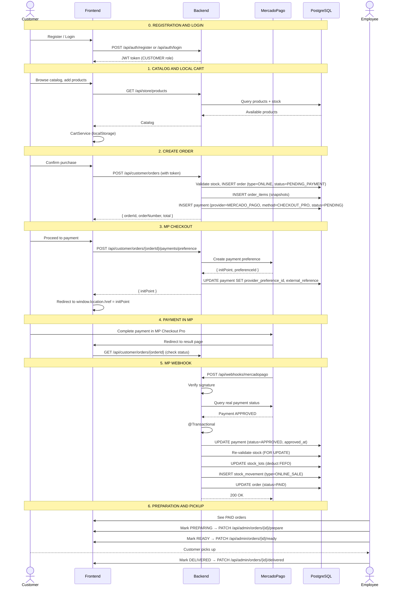

# Process: Online Purchase with Pickup

> This is the main end-to-end flow for the MVP. Customer registers, browses, purchases online, and picks up at the branch.

## Sequence diagram

## Business rules

| Rule | Step |
|---|---|
| Customer must be registered (CUSTOMER role) | 0 |
| Cart is local (localStorage) | 1 |
| Order created as PENDING_PAYMENT, stock NOT deducted yet | 2 |
| Payment created alongside the order (PENDING) | 2 |
| MP checkout creates preference (separate endpoint) | 3 |
| Webhook verifies signature AND queries real status from MP | 5 |
| If APPROVED: update payment, deduct FEFO, order to PAID | 5 |
| If REJECTED: update payment, order to PAYMENT_FAILED | 5 |
| If approved but no stock: order to STOCK_CONFLICT | 5 |
| DELIVERED only changes status, does NOT deduct stock again. DELIVERED = handed to customer at branch (NOT home delivery). | 6 |
