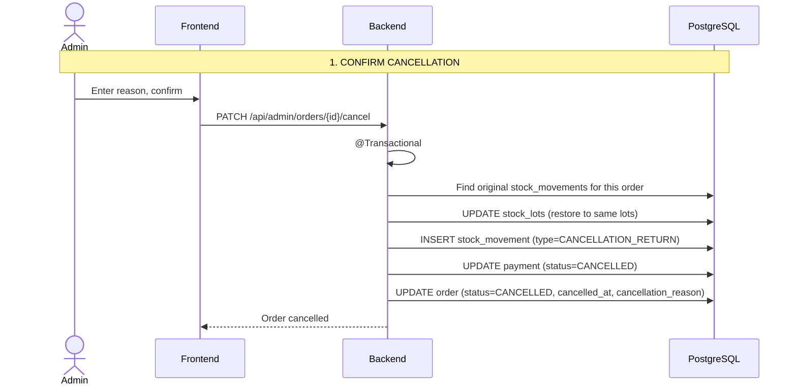

# Process: Order Cancellation with Stock Reversal

## Sequence diagram

## Cancellation rules by order status

| Current status | Cancellable? | Stock action | Payment action |
|---|---|---|---|
| PENDING_PAYMENT | Yes | No stock deducted | CANCELLED |
| PAID | Yes | Reverse stock | CANCELLED |
| PREPARING | Yes | Reverse stock | CANCELLED |
| READY | Yes (admin) | Reverse stock | CANCELLED |
| DELIVERED | No | -- | -- |
| CANCELLED | No | -- | -- |
| STOCK_CONFLICT | Yes | No stock deducted | CANCELLED |
| PAYMENT_FAILED | Yes | No stock deducted | CANCELLED |

## Stock reversal details

When cancelling a paid order:

1. The system looks up the original stock_movements for the order (type=ONLINE_SALE or POS_SALE)
2. Each movement references the specific stock_lot that was deducted
3. Stock is restored to the exact same lots
4. A new stock_movement is created with type=CANCELLATION_RETURN
5. This maintains lot traceability throughout the order lifecycle
