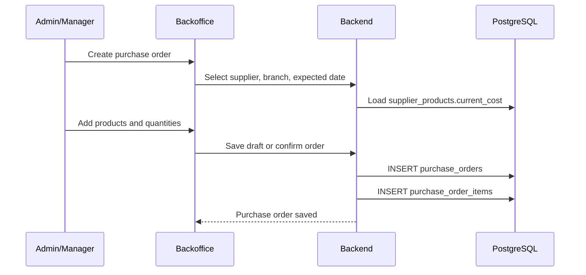

# Process: Purchase Order

A purchase order represents the intention to buy products from a supplier. It does not modify stock.

## Flow



## Rules

| Rule | Description |
|---|---|
| No stock impact | Purchase orders never create lots or stock movements |
| Expected cost snapshot | `purchase_order_items.unit_cost` is preloaded from `supplier_products.current_cost` but can be edited |
| Frozen order cost | Later supplier cost changes do not modify existing confirmed orders |
| Supplier scope | Each order belongs to one supplier and one branch |

## States

```text
DRAFT -> CONFIRMED -> SENT -> PARTIALLY_RECEIVED -> RECEIVED
DRAFT -> CANCELLED
CONFIRMED -> CANCELLED
SENT -> CANCELLED
```

## Partial reception

An order can be received across multiple purchase receipts. If only part of the ordered quantity arrives, the order moves to `PARTIALLY_RECEIVED` and can receive the remaining quantity later or be closed with missing items according to permissions.
