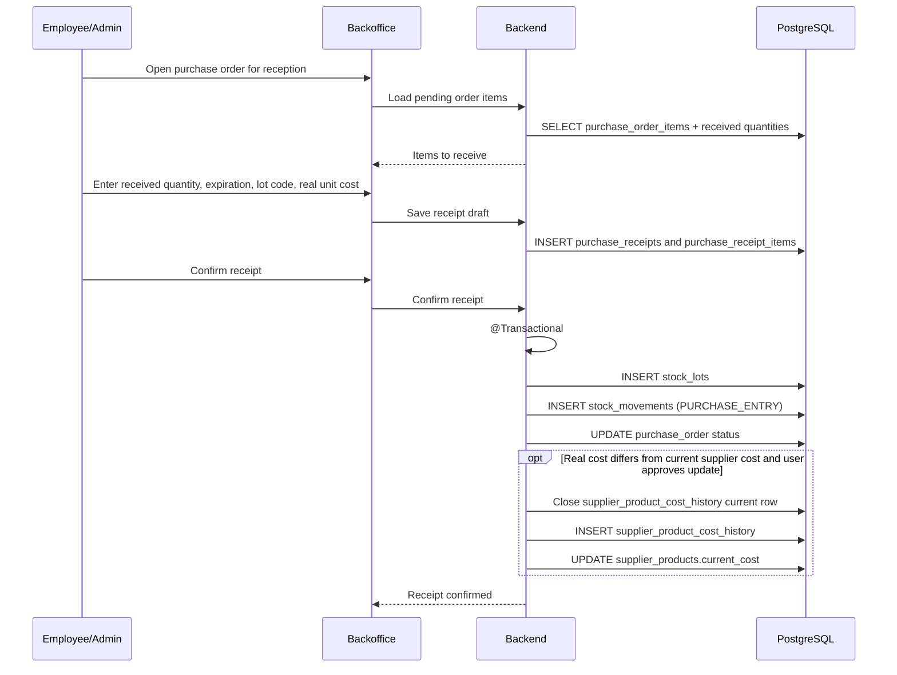

# Process: Purchase Receipt and Stock Entry

A purchase receipt represents the real arrival of merchandise. Confirming a receipt is the only supplier-purchase flow that increases stock.

## Flow



## Confirmation rules

| Rule | Description |
|---|---|
| Transactional confirmation | Lots, movements, receipt status, and order status are updated atomically |
| One lot per receipt item | Each confirmed receipt item creates a stock lot |
| Purchase movement | Each created lot creates a `PURCHASE_ENTRY` movement |
| Real cost | `purchase_receipt_items.unit_cost` becomes `stock_lots.unit_cost` |
| Frozen lot cost | The lot unit cost is immutable after creation |
| Supplier cost update | If real cost differs from `supplier_products.current_cost`, the system asks whether to update replacement cost |

## Special cases

| Case | Rule |
|---|---|
| Less quantity arrives | Order becomes `PARTIALLY_RECEIVED` |
| More quantity arrives | Allowed only with permission and must be traceable |
| Product not ordered | Allowed as an extra receipt item with `purchase_order_item_id = null` |
| Cost differs | Lot always uses received cost; supplier replacement cost updates only after user approval |

## Stock result example

```text
Receipt item:
Product: Yerba 1kg
Quantity received: 24
Real unit cost: 5300
Expiration date: 2026-12-31
Lot code: YER-2026-12

Result:
stock_lots.initial_quantity = 24
stock_lots.quantity_available = 24
stock_lots.unit_cost = 5300
stock_movements.type = PURCHASE_ENTRY
```

If the supplier later increases the cost to 5800, existing lots remain unchanged.
