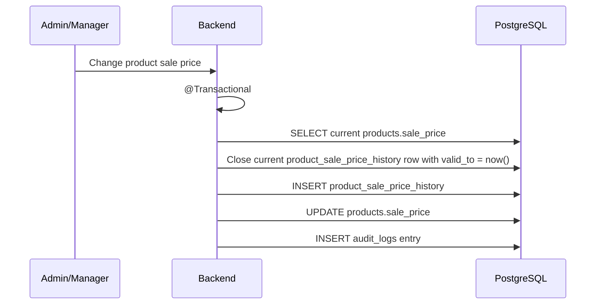

# Process: Sale Price History

`products.sale_price` stores the current operational sale price used by POS and the online store. Commercial price history is stored in `product_sale_price_history`.

## Flow



## Rules

| Rule | Description |
|---|---|
| Operational current price | `products.sale_price` is the value used by catalog queries, POS, and checkout |
| Dedicated history | `product_sale_price_history` is the source for price history reports |
| Audit is not price history | `audit_logs` records who changed prices, but reports should not query audit logs for price periods |
| Sold price snapshot | `order_items.unit_price` freezes the price charged in a sale |
| Transactional update | The current price and its history are updated in the same transaction |

## Sources

Common sale price change sources:

```text
MANUAL_UPDATE
PRICE_UPDATE_BATCH
PURCHASE_RECEIPT_SUGGESTION
PROMOTION_END
CORRECTION
```

## Example

```text
Before:
products.sale_price = 8000

Manual update:
new_price = 8500
reason = supplier increase

After:
previous product_sale_price_history.valid_to = now()
new product_sale_price_history.new_price = 8500
products.sale_price = 8500
```
