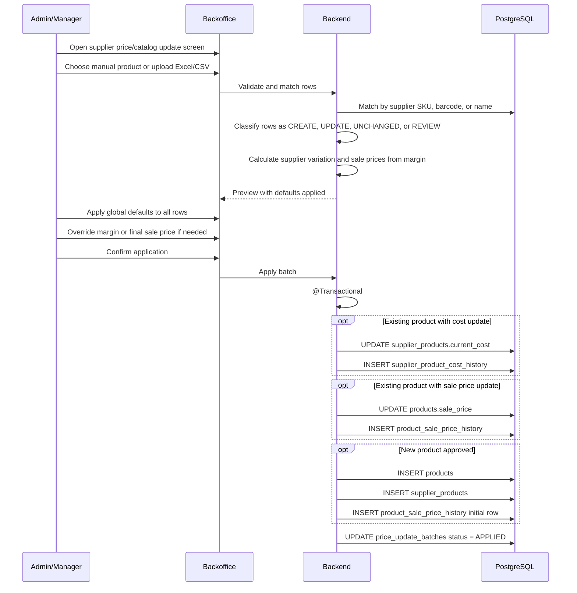

# Process: Supplier Price Update and Catalog Import Batch

Supplier price batches let the admin update replacement costs, update sale prices, and optionally create new products from a supplier list. They do not modify stock or existing lot costs.

## Screen purpose

The backoffice screen works as a unified workflow:

1. Manual update for one product.
2. Excel/CSV import for many products.
3. Preview of all affected rows before saving.
4. Global default options for all rows.
5. Per-row overrides before applying.

Nothing is persisted until the admin confirms the preview.

## Flow



## Row statuses

| Status | Meaning | Required admin input |
|---|---|---|
| CREATE | Supplier row does not match an existing product | Product data review, profit margin, final sale price |
| UPDATE | Existing product has cost or sale-price-relevant changes | Margin and final sale price review |
| UNCHANGED | Existing product has no relevant cost change | Usually no action |
| REVIEW | Match is ambiguous or required data is missing | Link to an existing product, create as new, or exclude |
| EXCLUDED | Admin chose not to apply this row | No persistence |

## Global defaults and apply-all action

The preview must include a prominent action such as:

```text
Apply defaults to all rows
```

Default options should include:

| Default | Applies to | Meaning |
|---|---|---|
| Profit margin | CREATE and UPDATE rows | Margin used to calculate sale price from replacement cost |
| Apply cost updates | UPDATE rows | Whether to update `supplier_products.current_cost` |
| Apply sale price updates | CREATE and UPDATE rows | Whether to update `products.sale_price` |
| Exclude unchanged rows | UNCHANGED rows | Keeps preview clean and avoids no-op writes |

The admin can apply these defaults to all rows and then override any product individually.

## Pricing formula

Both existing and new products use the same margin-based pricing formula:

```text
sale_price = replacement_cost / (1 - profit_margin)
```

Example:

```text
Supplier cost: 4000
Profit margin: 35%
Final sale price = 4000 / (1 - 0.35) = 6153.85
```

If the admin edits the final sale price manually, the system derives the resulting margin:

```text
profit_margin = (1 - replacement_cost / final_sale_price) * 100
```

Supplier variation is still calculated for existing products, but it is informational only:

```text
supplier_variation = (new_cost - old_cost) / old_cost * 100
```

## Preview table

Recommended columns:

| Column | Purpose |
|---|---|
| Status | CREATE, UPDATE, UNCHANGED, REVIEW, EXCLUDED |
| Supplier product name | Name from supplier list |
| Matched product | Existing product or proposed new product |
| Supplier SKU/barcode | Matching and traceability |
| Old cost | Current `supplier_products.current_cost` |
| New cost | Cost from file/manual input |
| Supplier variation | Increase/decrease percentage for existing products, informational only |
| Current sale price | Current `products.sale_price` |
| Margin | Per-row target margin used to calculate sale price |
| Suggested sale price | Calculated by system |
| Final sale price | Editable value that will be persisted |
| Apply | Whether this row will be applied |

## Rules

| Rule | Description |
|---|---|
| Human approval | No supplier list is applied automatically without preview confirmation |
| Manual and import in one screen | The same workflow supports one-product manual update and Excel/CSV batch import |
| Product creation supported | Unmatched rows can be created as new products if the admin approves them |
| Margin-based pricing | Existing and new products use replacement cost plus target margin |
| Price override | Editing final sale price derives the resulting margin |
| Supplier variation | Existing-product supplier variation is informational and does not drive price calculation |
| Global defaults | The admin can set defaults and apply them to all rows |
| Per-row override | Any calculated value can be adjusted product by product before applying |
| No stock impact | Batches never create lots or stock movements |
| No lot mutation | Existing `stock_lots.unit_cost` values remain unchanged |
| Cost history | Every applied replacement cost change is stored in `supplier_product_cost_history` |
| Sale price history | Every applied sale price change is stored in `product_sale_price_history` |

## Batch types

```text
SUPPLIER_FILE
PERCENTAGE_INCREASE
MANUAL_GRID
SINGLE_PRODUCT_MANUAL
```

## Batch states

```text
DRAFT -> VALIDATED -> APPLIED
DRAFT -> CANCELLED
VALIDATED -> CANCELLED
```
